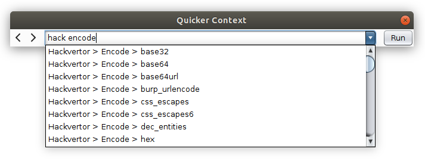

# Burp-Quicker-Context-Extension

This extension adds the "Quicker Context" dialog which is a lightweight dialog to quickly select tabs or execute application- and context-menu-entries more easily by typing parts of the name or choosing one stored in history. The dialog can either be opened using the "Quicker..." context menu entry or by pressing a customizable keyboard shortcut (default = shift + space).

## Usage

The Quicker Context Dialog can be completely controlled using the keyboard:

* ARROW-UP/ARROW-DOWN: Select context menu entry in list
* ENTER: Run selected contex menu entry
* CTRL+TAB: Next context menu entry in history
* CTRL+SHIFT+TAB: Previous context menu entry in history
* ESCAPE: Close the dialog

## Limitations

Currently context-menu-entries can only be selected when the "Quicker Context" dialog is opened via the "Quicker..." context menu entry. 

## Build

This project was built using IntelliJ and Gradle. When you make changes to the source (and especially the GUI) you should apply following settings within Intellij to make sure that everything builds successfully:
* File -> Settings -> Editor -> GUI Designer -> Generate GUI into: Java source
* File -> Settings -> Build, Execution, Deployment -> Compiler -> Build project automatically
* File -> Settings -> Build, Execution, Deployment -> Build Tools -> Gradle -> B
uild and run using: IntelliJ IDEA

When the GUI is not updated correctly you may rebuild the project manually:
* Build -> Rebuild Project

After that you can execute the "fatJar"-task within the "build.gradle"-file. This will produce a jar in the "build/libs/" directory called "burp-send-to-extension-{version}.jar".
